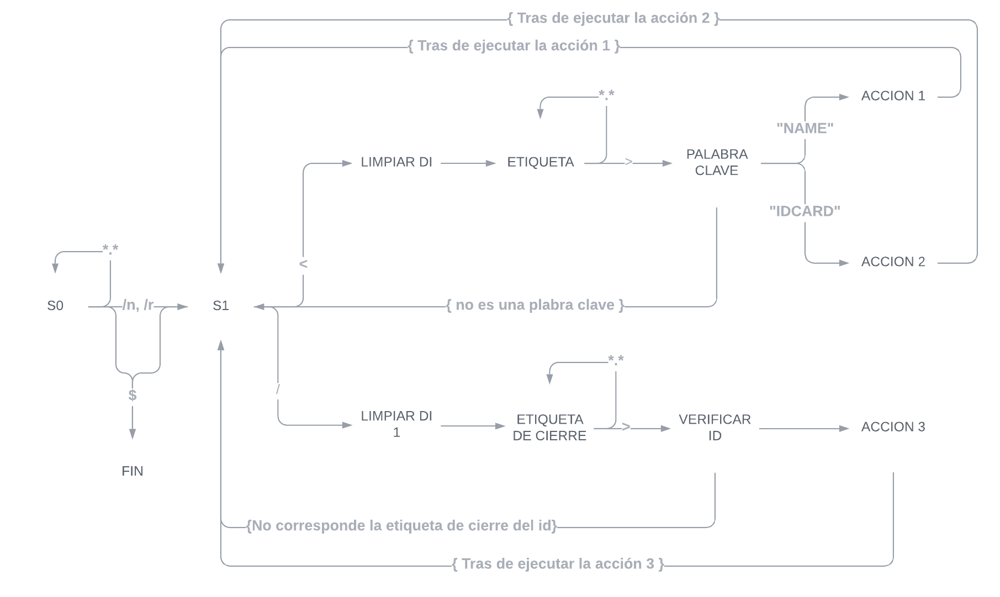

## ANÁLISIS Y CARGA DEL ARCHIVO XML

## Descripción

En este apartado se encuentran el código utilizado para realizar la lectura y análisis del archivo de entrada en formato XML, anteriormente ya se menciono el alcance y la estructura que debe de llevar el archivo de entrada.

## Grafo De estados



> ### Descripción de los estados

| Estado             | Descripción                                                                                                                                                                                    |
| ------------------ | ---------------------------------------------------------------------------------------------------------------------------------------------------------------------------------------------- |
| S0                 | estado inicial, el cual ignorará la primera linea                                                                                                                                              |
| S1                 | estado donde verifica si es una etiqueta que se este abriendo o es una etiqueta de cierre                                                                                                      |
| LIMPIAR DI         | estado donde se limpiara el registro **DI**                                                                                                                                                    |
| ETIQUETA           | estado donde se almacena dentro de un buffer todos los caracteres de la etiqueta hasta que encuentre el símbolo de cierre ( **>**)                                                             |
| PALABRA CLAVE      | estado donde verifica si el id almacenado en el estado anterior es una de las palabras claves o reservadas, se tomaron como palabras claves los siguientes id's:  <br/>- *NAME*<br/>- *IDCARD* |
| ACCION1            | estado donde almacena el nombre del estudiante omitiendo los espacios                                                                                                                          |
| ACCION2            | estado donde almacena el idCard o carnet del estudiante omitiendo los guiones que este pueda tener                                                                                             |
| LIMPIAR DI 1       | estado donde se limpiara el registro **DI**                                                                                                                                                    |
| ETIQUETA DE CIERRE | estado donde se almacena dentro de un buffer todos los caracteres hasta que encuentre el símbolo de **>**                                                                                      |
| VERIFICAR ID       | estado donde se verifica si la etiqueta de cierre corresponde de a la etiqueta  `<STUDENTn>` (donde n es el número de estudiante) para poder mostrar el resultado de las acciones realizadas.  |
| ACCION3            | estado donde se muestra el resultado de las dos acciones anteriores y se limpian los buffer's.                                                                                                 |
| FIN                | estado final, al encontrar el símbolo de fin de archivo <<EOF>> (**$**)                                                                                                                        |

## Código

> ### Parámetros

| Parámetro | Descripación                                                      |
| --------- | ----------------------------------------------------------------- |
| buffer    | buffer que almacena el contenido del archivo anteriormente leído. |

> ### Macro

```nasm
analisis MACRO buffer

    .data
        ;; ///////// palabras claves o reservadas ////////////////////////////////////

        pcNombre     DB "name$"
        pcRegistro     DB "idcard$"

        ;; ///////// Buffer's ////////////////////////////////////
        bufferRespaldoId DB 100 DUP('$'), '$'
        bufferString      DB 100 DUP('$'), '$'
        bufferNombre       DB 100 DUP('$'), '$'
        bufferRegistro      DB 100 DUP('$'), '$'

        ;; ///////// mensajes ////////////////////////////////////
        msgId        DB 0Ah, "ID: $"
        msgEndId    DB 0Ah, "FIN_ID", 0Ah, "$"

        msgNombre    DB 0Ah, 09h, "NOMBRE: $"
        msgRegistro    DB 0Ah, 09h, "REGISTRO: $"


    .code
        CALL limpiarRegistros
        MOV si, -1

        S0:
            CALL siguienteCaracter

            CMP bl, 10                            ;; if bl = '\n' (salto de linea)
                JE S1
            CMP bl, 13                            ;; if bl = '\r' (regreso de carro)
                JE S1
            CMP bl, 36                            ;; if bl == '$' (FIN_ANALISIS de archivo->EOF)
                JE FIN_ANALISIS
            JMP S0 

        S1: 
            CALL siguienteCaracter

            CMP bl, 36                            ;; if bl == '$' (FIN_ANALISIS de archivo->EOF)
                JE FIN_ANALISIS
            CMP bl, 47                            ;; if bl == '/'
                JE LIMPIAR_DI_1
            CMP bl, 60                            ;; if bl == '<'
                JE LIMPIAR_DI

            JMP S1

        LIMPIAR_DI:
            limpiarBuffer     bufferString
            XOR             di, di

        ETIQUETA:
            CALL siguienteCaracter

            CMP bl, 47                            ;; if bl == '/'
                JE LIMPIAR_DI_1
            CMP     bl, 62                            ;; if bl == '>'
                JE PALABRA_CLAVE

            MOV bufferString[di], bl
            INC di
            JMP ETIQUETA

        PALABRA_CLAVE:

            CALL respaldo

            compararIngorandoCase pcNombre, bufferString           ;; kwAdd.equalIgnoreCase(buffer)
            JE ACCION_1

            compararIngorandoCase pcRegistro, bufferString           ;; kwAdd.equalIgnoreCase(buffer)
            JE ACCION_2

            copyData bufferRespaldoId, bufferString


            CALL restaurar

            JMP S1


        ACCION_1:
            CALL restaurar
            CALL leerNombre
            JMP  S1


        ACCION_2:
            CALL restaurar
            CALL leerCarnet
            JMP  S1


        LIMPIAR_DI_1:
            limpiarBuffer     bufferString
            XOR             di, di

        ETIQUETA_DE_CIERRE:
            CALL siguienteCaracter
            CMP     bl, 62                            ;; if bl == '>'
                JE VERIFICAR_ID

            MOV bufferString[di], bl
            INC di
            JMP ETIQUETA_DE_CIERRE

        VERIFICAR_ID:
            CALL respaldo
            compararIngorandoCase  bufferRespaldoId, bufferString

            JE      ACCION_3
            CALL restaurar
            JMP  S1

        ACCION_3:

            imprimir msgId
            imprimir bufferRespaldoId

            imprimir msgNombre
            imprimir bufferNombre

            imprimir msgRegistro
            imprimir bufferRegistro
            imprimir msgEndId

            limpiarBuffer bufferRespaldoId
            limpiarBuffer bufferNombre
            limpiarBuffer bufferRegistro

            CALL restaurar
            JMP  S1    


        leerNombre PROC
            XOR di, di 

            L1:
                CALL siguienteCaracter

                CMP  bl, 60                        ;; if bl == '<'
                 JE  L2 
                CMP  bl, 32                        ;; if bl == ' '
                 JE  L1 

                MOV bufferNombre[di], bl
                INC di

                JMP L1 

            L2: 
                ret
        leerNombre ENDP

        leerCarnet PROC
            XOR di, di 

            L1:
                CALL siguienteCaracter

                CMP  bl, 60                        ;; if bl == '<'
                 JE  L2 
                CMP  bl, 45                        ;; if bl == '-'
                 JE  L1
                MOV bufferRegistro[di], bl
                INC di

                JMP L1 

            L2: 
                ret
        leerCarnet ENDP

        siguienteCaracter PROC
            INC si
            MOV bl, buffer[si]
            ret 
        siguienteCaracter ENDP


        FIN_ANALISIS:

ENDM
```
