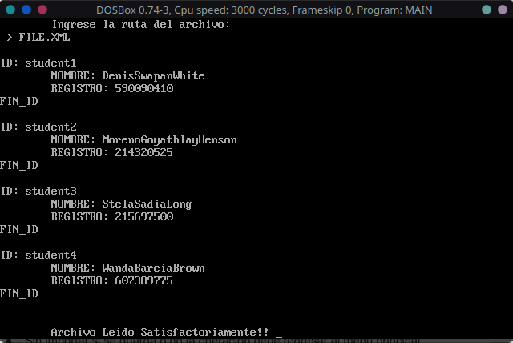
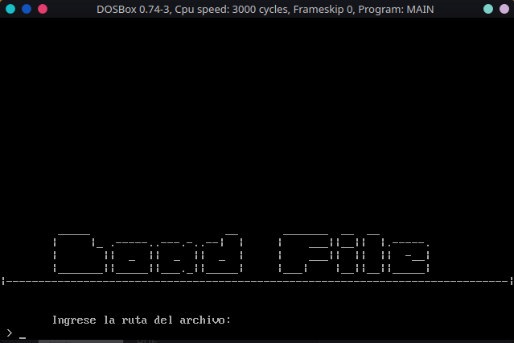

# LECTURA DE ARCHIVO XML (*BAJO UNA ESTRUCTURA ESPECÍFICA*)

## Fines

* Este ejemplo fue realizado únicamente con fines educativos, el código utilizado queda con  acceso y uso libre para que puedan basarse de la idea y mejorarla o adaptarlo a sus necesidades. 

## Alcances

* El ejemplo realizado no tiene la capacidad de realizar un análisis de un XML genérico .

* El ejemplo solo tiene la capacidad de analizar un archivo XML, bajo una estructura específica que más adelante se describirá.

* Lo archivos de prueba debe de estar sin ningún tipo de error ya que no fue considerado, es decir:
  
  * Toda etiqueta que fue abierta esta debe tener su respectiva etiqueta de cierre.
  
  * Por lo mismo del punto anterior al encontrar una etiqueta de cierre **no**  se verifica si es la etiqueta correspondiente a la etiqueta anteriormente abierta. 

## Estructura del Ejemplo

```
.
`-- Read_XML/
    |-- analysis/
    |   `-- analysis.asm
    |-- docs/
    |-- ctrllr/
    |   |-- loadCtrl.asm
    |   `-- menuCtrl.asm
    |-- macros/
    |   |-- file.asm
    |   `-- macros.asm
    |-- file.xml
    |-- main.asm
    |-- MAIN.EXE
    `-- views/
        |-- loadView.asm
        `-- menuView.asm
```

> ### Descripción de algunas carpetas o archivo de la estructura

| Archivo / Carpeta | Descripción                                                                                                                       |
| ----------------- | --------------------------------------------------------------------------------------------------------------------------------- |
| analysis/         | en esta carpeta se encuentra la macro realizado para el análisis del archivo de entrada.                                          |
| ctrllr/           | en esta carpeta se encuentra los controladores correspondiente a cada vista, son macros el cual contiene la lógica de cada vista. |
| macros/           | en esta carpeta se encuentran las macros de propósito general así como también las macros usadas para el manejo de archivos.      |
| docs/             | en esta carpeta se encuentra los archivos de documentación                                                                        |
| file.xml          | estos son los archivos de entrada para realizar analisi                                                                           |
| main.asm          | es el archivo principal de la practica                                                                                            |
| MAIN.EXE          | ejecutable del ejemplo                                                                                                            |
| views/            | en esta carpeta se encuentran las vistas de cada uno de las opciones (Menú y carga de archivo)                                    |

## Estructura del archivo XML

El archivo contendrá una lista de estudiantes con un los siguientes datos:

* Nombre que viene con espacios entre nombres y apellidos

* Registro o carne que tiene guiones. 
  
  ```xml
  <STUDENT>
      <STUDENT1>
          <name> .... </name>
          <idCard> .... </idCard>
      </STUDENT1>
      .
      .    
      .
      <STUDENTn>
          <name> .... </name>
          <idCard> .... </idCard>
      </STUDENTn>
  </STUDENT>
  ```
  
  Con el fin de ejemplificar se necesita que de salida muestre la siguiente etstructura:
  
  ```
  ID: [la itequeta que contiene los datos del estudiante]
      NOMBRE: [nombre del estudiante sin espacios]
      REGISTRO: [registros del estudiante sin guiones]
  FIN_ID
  ```

> ### Archivo de entrada de ejemplo

```xml
<STUDENT>
    <STUDENT1>
        <NAME>Denis Swapan White</NAME>
        <idCard>590-09-0410</idCard>
    </STUDENT1>    

    <STUDENT2>
        <nAmE>Moreno Goyathlay Henson</nAmE>
        <idcard>214-32-0525</idcard>
    </STUDENT2>    

    <STUDENT3>
        <NAMe>Stela Sadia Long</NAMe>
        <IdCaRD>215-69-7500</IdCaRD>
    </STUDENT3>    

    <STUDENT4>
        <NAMe>Wanda Barcia Brown</NAMe>
        <IdCaRD>607-38-9775</IdCaRD>
    </STUDENT4>    

</STUDENT>
```

> ### Salida esperada

```
ID: student1
    NOMBRE: DenisSwapanWhite
    REGISTRO: 590090410
FIND_ID


ID: student2
    NOMBRE: MorenoGoyathlayHenson
    REGISTRO: 214320525
FIND_ID

ID: student3
    NOMBRE: StelaSadiaLong
    REGISTRO: 215697500
FIND_ID


ID: student4
    NOMBRE: WandaBarciaBrown
    REGISTRO: 607389775
FIND_ID
```

> ### Salida Obtenida



## Capturas de Pantalla

> ### Menú Principal


> ### Carga de Archivo

